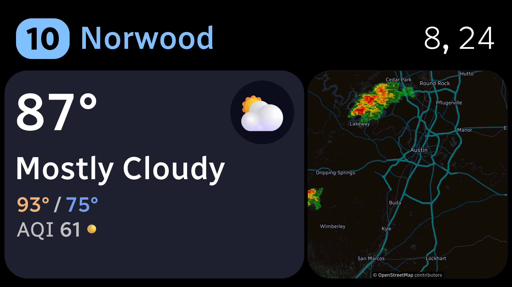

# Busboard

A tablet-sized dashboard for showing the current weather, forecast, and radar, as well as the next bus departures from the closest CapMetro bus stop. (Obviously, the latter will only work well if you live in Austin!)

- The weather forecast uses the METAR issued by the closest NWS weather station (likely an airport).
- The forecast uses the NWS forecast for your geolocation.
- The radar is sourced from NOAA and will appear when the chance of rain is significant.
- The bus times are loaded from CapMetro's GTFS-Realtime feed. (So you could swap the feeds out for a different transit agency's, so long as they support GTFS.)
- Access to NWS and OpenStreetMap API's requires that you change the user agent string. These are set in the Cloudflare secrets.

Here's a preview of what the app looks like:

I host this on Cloudflare Pages and then display it on a cheap Amazon Fire tablet in my kitchen.